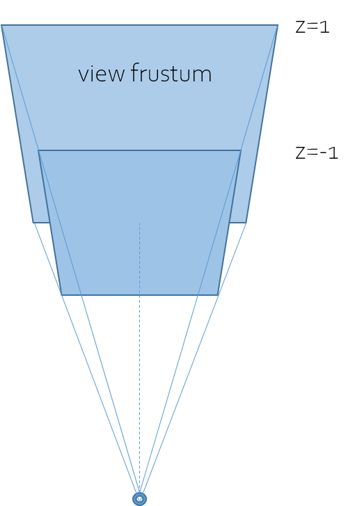

### orthographic

a more flexible projection method.

[
  2 / (right - left), 0, 0, 0,
  0, 2 / (top - bottom), 0, 0,
  0, 0, 2 / (near - far), 0,

  (left + right) / (left - right),
  (bottom + top) / (bottom - top),
  (near + far) / (near - far),
  1,
]

### perspective

(x', y') = (x, y) / (1.0 + fudgeFactor * z)

give fudgeFactor 1.0, then 1.0 + fudgeFactor * z is between 0 and 2

we see from the (0, 0, -1), or camera is on (0, 0, -1), so we can get the primitive perspective view.

### homogeneous space

shaders convert our matrix to homogeneous automatically

like this: `[x, y, z, w] => [x/w, y/w, z/w, 1]`

so a perspective matrix could be like this:

[ 1, 0, 0, 0,
  0, 1, 0, 0,
  0, 1, 1, fudgeFactor,
  0, 0, 0, 1]

which means: `w_out = x_in * 0 + y_in * 0 + z_in * fudgeFactor + 1.0`

### view frustum

