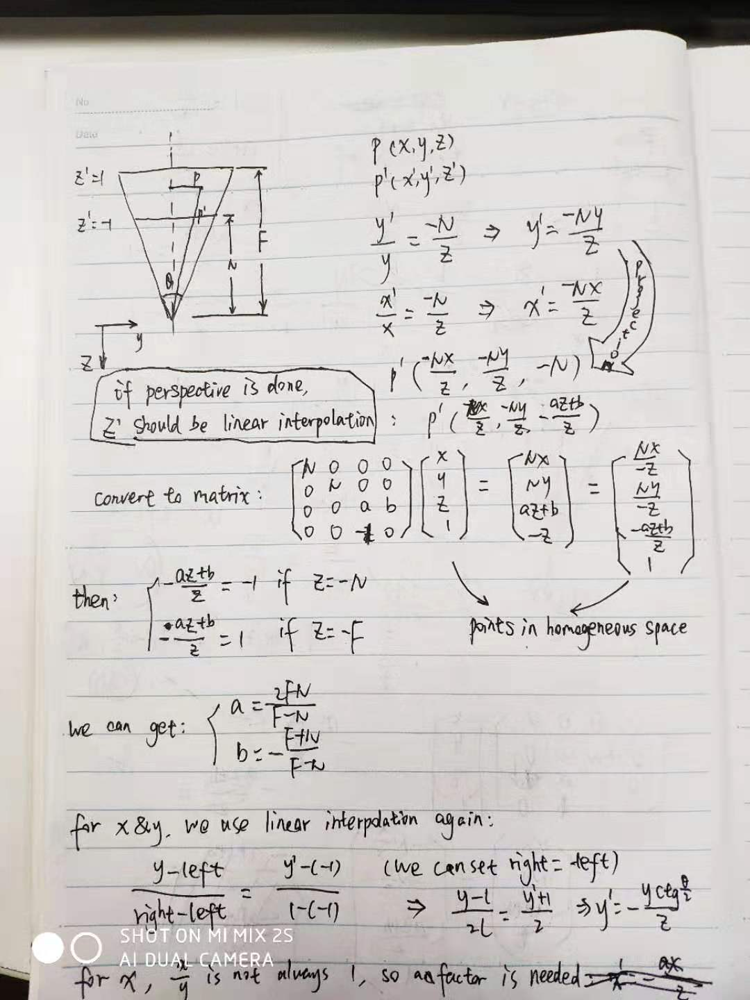

# from frustum to canonical view volume

## normal perspective (lookAt)

> previous version
>> projection --- m4.projection: project a bastard space to a standard space (x, y, z in -1 to 1, respectively)
>> perspective --- scale (x, y) based on z, such as `x / (1.0 + z * fudgement)`
>
> current version
>> perspective --- use an unique matrix to convert all of these


```javascript
perspective: function(fieldOfViewInRadians, aspect, near, far) {
  var f = Math.tan(Math.PI * 0.5 - 0.5 * fieldOfViewInRadians);
  var rangeInv = 1.0 / (near - far);

  return [
    f / aspect, 0, 0, 0,
    0, f, 0, 0,
    0, 0, (near + far) * rangeInv, -1,
    0, 0, near * far * rangeInv * 2, 0
  ];
}
```

this function is widely used in perspective

## some attentions

at first, in our view, the positive of x is right, y is down, z is inner.

without perspective, we can regard camera position as Infinity.

so if we add `translateZ`, we move the object inner, and if it exceed the range of z, something will miss.

after perspective, the positive of x is right, y is up, z outer, which is a standard model in our thought.

and then, our y + 100 & z + 100 means move y upper for 100 units and z outer for 100, respectively.

### about rot direction

if we look at positive x/y/z, positive spin angle will make anticlockwise rotation

### how to get this function ??



