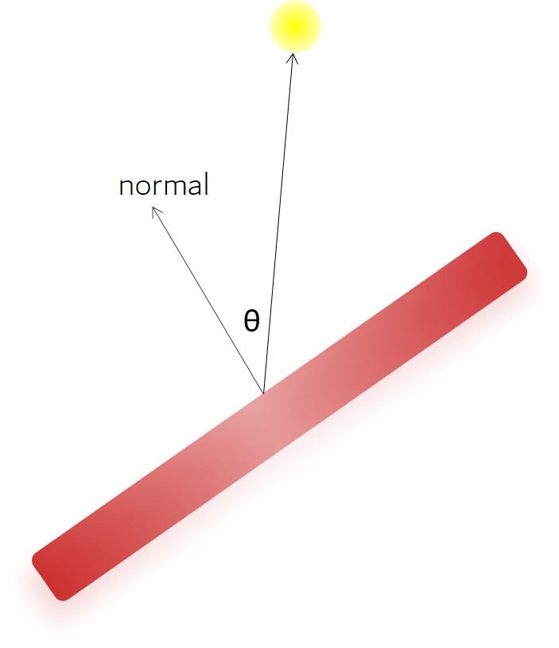

## point light

we make the dot of the normal & the surfaceToLight direction

you should always notice the different matrix used for different vector

for the normal: [invert][transpose]{scale * rot}

for the position: {scale * rot * translate * lookAt * perspective}

for the light: {scale * rot * translate}

